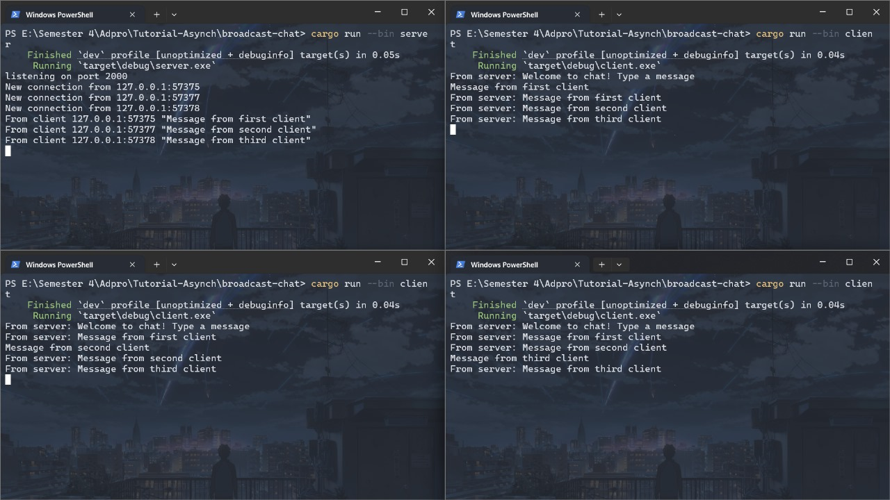
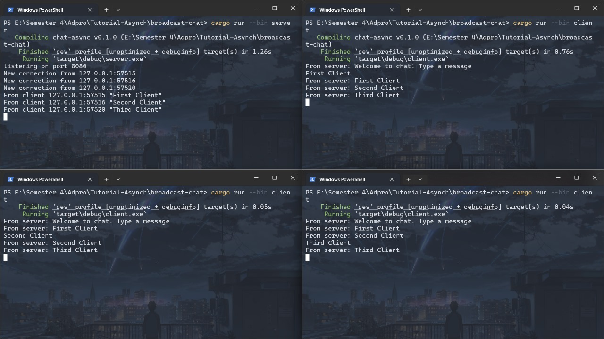
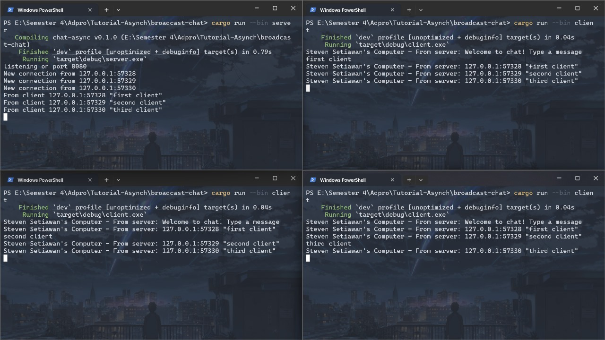

# Reflection

## Original Code and How It Runs

Untuk menjalankan server dan klien, kita dapat melakukan _step-step_ berikut:

1. Buka 4 terminal terpisah.

2. Atur direktori saat ini ke direktori proyek untuk semua terminal.

3. Pada terminal pertama, jalankan server dengan mengetik `cargo run --bin server`.

4. Pada 3 terminal lainnya, jalankan klien dengan mengetik `cargo run --bin client`.

Ketika sebuah pesan diketik dan dikirim melalui klien, server akan menerima pesan tersebut, lalu mencetaknya dan menyiarkan pesan tersebut ke semua klien. Semua klien kemudian akan menerima pesan tersebut dan mencetaknya ke terminal.

## Modifying Port

Untuk mengubah port pada server, saya perlu mengubah nomor port `TCPListener` di file server.rs. Saya juga perlu mengubah nomor port di file client.rs agar sesuai dengan nomor port server. Protokol _websocket_ pada sisi server sendiri tidak dinyatakan secara eksplisit. Pada kode server, port di-_bind_ ke `TCPListener` yang menugaskan sebuah proses untuk mendengarkan koneksi TCP yang melewati port tersebut. Setelah koneksi dibuat, server kemudian membuat _socket_ yang kemudian diberikan ke _websocket handler_. Jadi, server tidak sepenuhnya mendeklarasikan protokol _websocket_ tersebut secara eksplisit, tetapi mengimplementasikan spesifikasi protokol _websocket_ melalui _crate_ `tokio-websocket`.

## Small Changes - Add IP and Port

Saya melakukan perubahan pada _server side_ karena server sudah melacak pesan mana yang sesuai dengan alamat mana (karena ketika klien pertama kali terhubung, sebuah _thread_ asinkronus baru dibuat yang menerima _message streams_ dari klien tersebut). Setiap host dari klien diberikan _thread_ dan _handler_ yang disimpan di dalam argumen `addr`, ini memungkinkan saya untuk hanya menyisipkan alamat pada pesan yang di-_broadcast_ kembali ke klien.